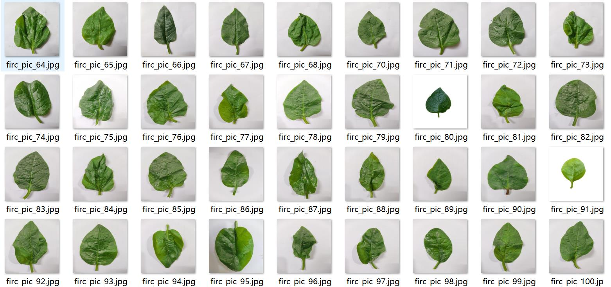
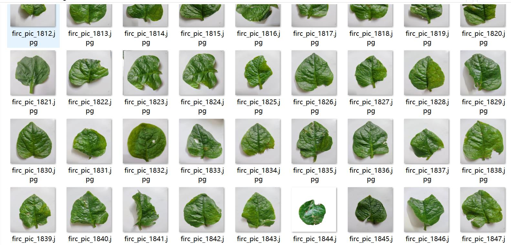
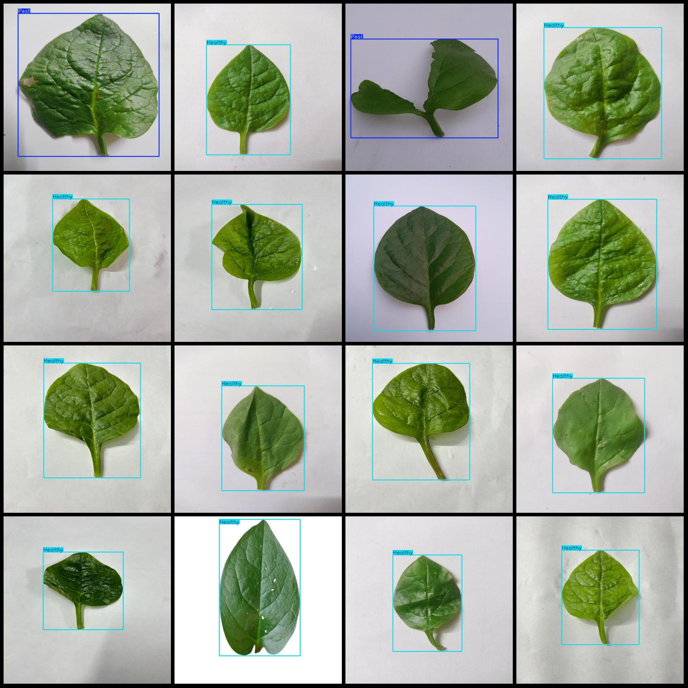
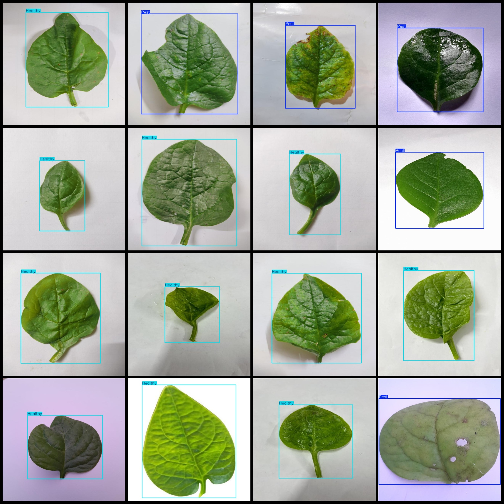

# Pascal VOC and YOLO format datasets for leaf diseases and pest detection in spinach leaves, 1911 images in two classes

Dataset format: Pascal VOC format + YOLO format (txt file without segmentation path, only containing jpg images along with corresponding VOC format xml files and yolo format txt files)
Number of images (jpg file count): 1911
Number of annotations (xml file count): 1911
Number of annotations (txt file count): 1911
Number of annotation categories: 2
Annotation category names (notice that the order of yolo format categories does not correspond to this, but according to the labels folder 'classes.txt': ["Healthy", "Pest"]):
- Healthy (healthy) boxes = 1398
- Pest (insect-infested leaves) boxes = 513
Total boxes: 1911
Each category occupies a number of images:
- Healthy (healthy) occupies 1398 images
- Pest (insect-infested leaves) occupies 513 images
Image resolution: 640x640
Annotation tool used: labelImg
Annotation rules: draw bounding boxes for each class
Important note: The dataset is not divided into training, validation, or testing sets, and must be self-divided.
Special declaration: This dataset does not guarantee the accuracy of the trained models or weight files.
Image preview:
Annotation example:

## Images

Here is a pay link on Stripe ( https://buy.stripe.com/3cs8yP7sY87d0vu9AB ). Please contact me lonlonago@foxmail.com after funding $89, and I will send you a complete data files , thank you!

